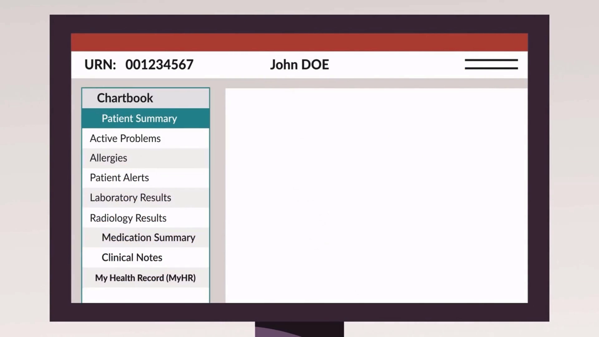

# Read-only EPR Familiarisation eLearning course

*An [Articulate Storyline 360](https://www.articulate.com/360/storyline/) eLearning course.*

## About

A demonstration-only course, explaining different sections of a read-only electronic patient record (EPR).

Scroll down to view the course contents.

## Course content

Please view these modules on a laptop, desktop or tablet device. The resolution of the screen recorded modules is fixed and not well suited to smaller mobile device screens.

Module [01 Introduction (7 mins)](/01/story.html) contains a visual explanation of how this course works.

Completion of each module is reported to the LMS once the "summary" slide of each module is reached.

1. [Introduction (7 mins)](/01/story.html)
2. [Using the chartbook (13 mins)](/02/story.html)
3. [Navigation and patient search (4 mins)](/03/story.html)

## Integration with LMS

Each module is a [SCORM](https://scorm.com/scorm-explained/one-minute-scorm-overview/) (Sharable Content Object Reference Model) package. It can be used with any [LMS](https://en.wikipedia.org/wiki/Learning_management_system) (Learning Management System) that supports version SCORM 1.2. SCORM modules are exported from [Articulate Storyline 360](https://www.articulate.com/360/storyline/) in ZIP format.

When run from an LMS, the SCORM reports these data to the LMS:

* `cmi.core.score.raw` – a number from 0 to 100 for the overall score
* `cmi.core.score.min` – 0
* `cmi.core.score.max` – 100
* `cmi.core.lesson_status` – 'completed' or 'incomplete'

## Credits

This eLearning course uses sound effects from [FreeSound](https://freesound.org/):
* [Slow typing sound effect](https://freesound.org/people/bonesawmgraw/sounds/572977/) by bonesawmgraw published in the [public domain](https://creativecommons.org/publicdomain/zero/1.0/),
* [Mouse Clicks, Mouse Double Clicks](https://freesound.org/people/ShanVpererea/sounds/542080/) by ShanVpererea published in the [public domain](https://creativecommons.org/publicdomain/zero/1.0/),

and graphics from [Vecteezy](https://www.vecteezy.com/):

* [Clock Icon Vectors by Vecteezy](https://www.vecteezy.com/free-vector/clock-icon),
* [Heart Vectors by Vecteezy](https://www.vecteezy.com/free-vector/heart),
* [Reminder Vectors by Vecteezy](https://www.vecteezy.com/free-vector/reminder),
* [Xray Vectors by Vecteezy](https://www.vecteezy.com/free-vector/xray),
* [Microscope Vectors by Vecteezy](https://www.vecteezy.com/free-vector/microscope),
* [Document Vectors by Vecteezy](https://www.vecteezy.com/free-vector/document)
