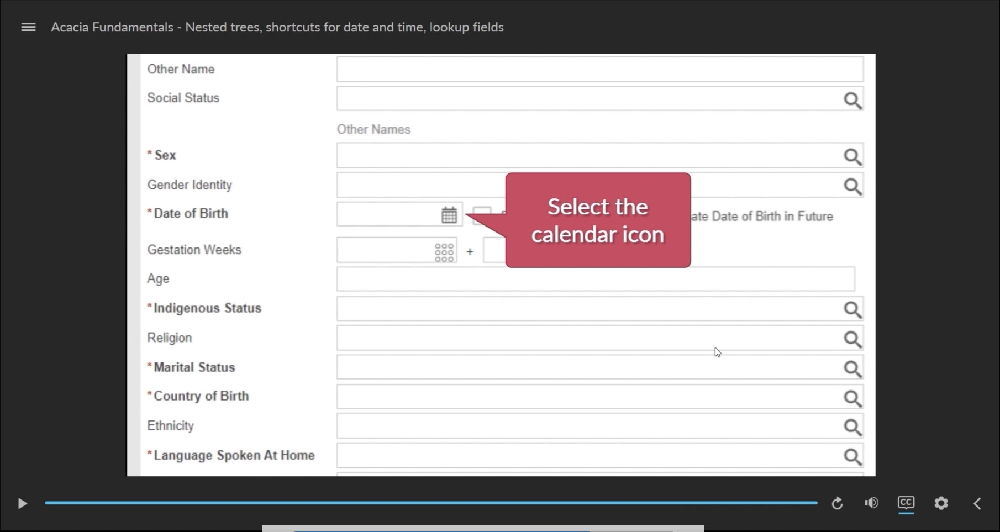

*An [Articulate Storyline 360](https://www.articulate.com/360/storyline/) eLearning course.*

## About

This course provides an understanding of basic features and functionality of a web-based clinical system named Acacia.

Click the image below to watch a 15 second preview of this course. Or, scroll down to view the course contents.

## Course content

Please view these modules on a laptop, desktop or tablet device. The resolution of the screen recorded modules is fixed and not well suited to smaller mobile device screens.

All modules are interactive, requiring eLearners to click or type on screen, to complete the module.

Completion of each module is reported to the LMS once the "summary" slide of each module is reached.

1. [01 Important information for users of Acacia](/01/story.html)
2. [02 Acacia basics](/02/story.html)
3. [03 Viewing patient lists, floorplans, allergies and alerts](/03/story.html)
4. [04 Menus and workflows](/04/story.html)
5. [05 Mandatory fields, hyperlinks and verify, apply and update information](/05/story.html)
6. [06 Expanding and hiding information, episode types and linked episodes](/06/story.html)
7. [07 Nested trees, shortcuts for recording date and time, and lookup fields](/07/story.html)
8. [08 Conclusion and next steps (3 mins)](/08/story.html)

## Integration with LMS

Each module is a [SCORM](https://scorm.com/scorm-explained/one-minute-scorm-overview/) (Sharable Content Object Reference Model) package. It can be used with any [LMS](https://en.wikipedia.org/wiki/Learning_management_system) (Learning Management System) that supports SCORM version 1.2. SCORM modules are exported from [Articulate Storyline 360](https://www.articulate.com/360/storyline/) in ZIP format.

When run from an LMS, the SCORM reports these data to the LMS:

* `cmi.core.score.raw` – a number from 0 to 100 for the overall score
* `cmi.core.score.min` – 0
* `cmi.core.score.max` – 100
* `cmi.core.lesson_status` – 'completed' or 'incomplete'

## Credits

This eLearning course uses sound effects from [FreeSound](https://freesound.org/):
* [mac typing](https://freesound.org/people/ThatMisfit/sounds/413462/) by ThatMisfit published in the [public domain](https://creativecommons.org/publicdomain/zero/1.0/)

and short animations from [Pixabay](https://pixabay.com/):

* [Operation Room Hospital](https://pixabay.com/videos/operation-room-hospital-surgery-71017/) by New_Make_Spot under the [Simplified Pixabay License](https://pixabay.com/service/license/),
* [Evaluation Analysis Magnifying](https://pixabay.com/videos/evaluation-analysis-magnifying-glass-69480) by mohamed_hassan under the [Simplified Pixabay License](https://pixabay.com/service/license/)
