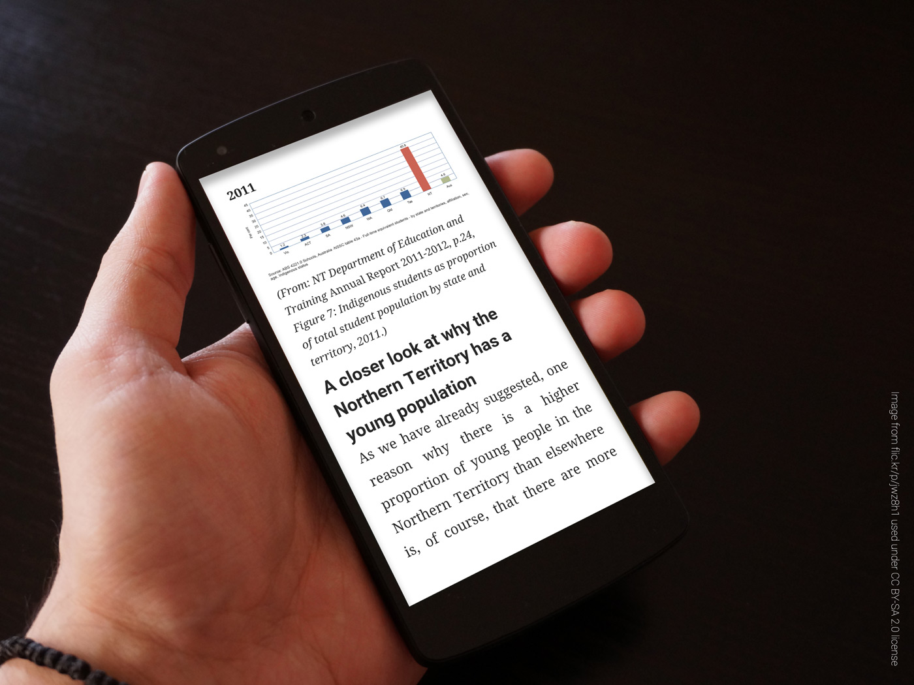
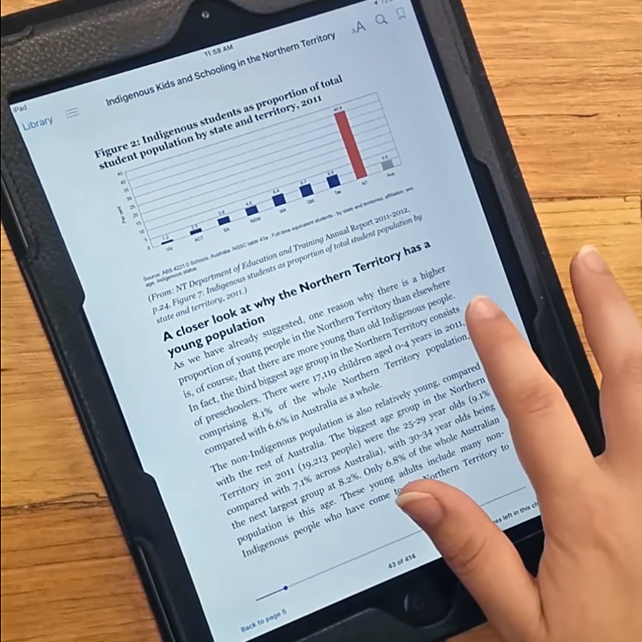

## About
The hardcopy of this book was originally published in 2014. I was tasked with creating an ebook version for distribution as a free download. The ebook was designed in Adobe InDesign CC 2015, then tested on a variety of Android and iOS devices with users of varying technical skill, and took approx 30 hours in total. The ebook is available as a [reflowable EPUB and in PDF format](http://batchelorpress.com/node/290) from the publisher, [Batchelor Press](http://batchelorpress.com/).

### [View as PDF](resources/indigenous-kids-schooling-nt.pdf)

### [Download as EPUB](resources/indigenous-kids-schooling-nt.epub)

## Demonstration video

Click below to watch a short demonstration video.

