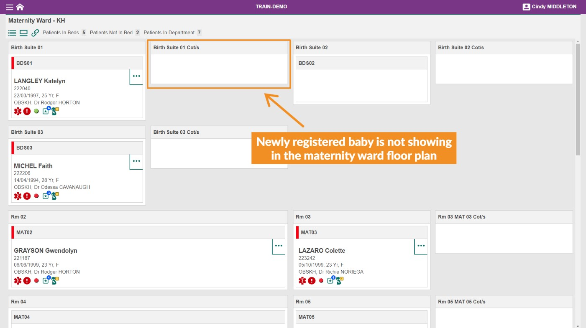
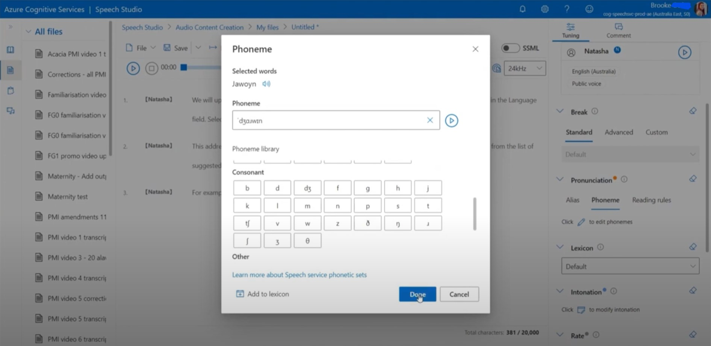

*Two branching [Articulate Storyline 360](https://www.articulate.com/360/storyline/) eLearning modules.*

## About

Two troubleshooting videos, explaining how to end users can self-resolve common mistakes.

Scroll down to view the troubleshooting modules.

## Course content

Please view these modules on a laptop, desktop or tablet device. The resolution of the screen recorded modules is fixed and not well suited to smaller mobile device screens.

Completion of each module is reported to the LMS once the "summary" slide of each module is reached.

1. [Can't find a newly registered baby in the floor plan](/01/story.html)
2. [Missing pregnancy information](/02/story.html)

## Integration with LMS

Each module is a [SCORM](https://scorm.com/scorm-explained/one-minute-scorm-overview/) (Sharable Content Object Reference Model) package. It can be used with any [LMS](https://en.wikipedia.org/wiki/Learning_management_system) (Learning Management System) that supports version SCORM 1.2. SCORM modules are exported from [Articulate Storyline 360](https://www.articulate.com/360/storyline/) in ZIP format.

When run from an LMS, the SCORM reports these data to the LMS:

* `cmi.core.lesson_status` – 'completed' or 'incomplete'

## Neural text-to-speech narration
These modules are narrated using Microsoft Azure text-to-speech service. This is a natural sounding, neural text to-to-speech tool which allows pronunciation to be customised and corrected using the international phonetic alphabet (IPA). Learn how I've been using the IPA to correct the pronunciation of Aboriginal nations and languages, in this 30 minute demo video:

