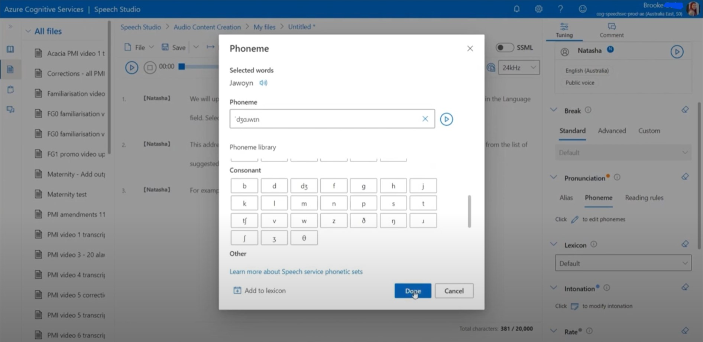

*An Articulate Storyline 360 eLearning course*

## About

A fully interactive, simulation style eLearning course explaining how to create a patient record in a hospital setting.

Scroll down to view the course contents.

## Course content

Please view these modules on a laptop, desktop or tablet device. The resolution of the screen recorded modules is fixed and not suited to smaller mobile device screens.

Module [01 Introduction and search for a patient record (8 mins)](/01/story.html) contains a visual explanation of how this course works.

Completion of each module is reported to the LMS once the "summary" slide of each module is reached.

1. [Introduction and search for a patient record (8 mins)](/01/story.html)
2. [Create a new patient record (7 mins)](/02/story.html)
3. [View, add and update patient addresses (5 mins)](/03/story.html)
4. [Manage other patient identification numbers, and record My Health Record consent (8 mins)](/04/story.html)
5. [View, add and update additional patient information (7 mins)](/05/story.html)
6. [Manage a patient's contact persons (9 mins)](/06/story.html)
7. [View and update patient allergies and alerts (7 mins)](/07/story.html)
8. [View documents (2 mins)](/08/story.html)
9. [View, add and update patient care provider information (5 mins)](/09/story.html)
10. [Update a patient's privacy Status (2 mins)](/10/story.html)
11. [Patient labels, deceased details and audit details (6 mins)](/11/story.html)
12. [Conclusion and next steps (3 mins)](/12/story.html)

## Integration with LMS

This application is provided as [SCORM](https://scorm.com/scorm-explained/one-minute-scorm-overview/) (Sharable Content Object Reference Model) module. It can be used with any [LMS](https://en.wikipedia.org/wiki/Learning_management_system) (Learning Management System) that supports version SCORM 1.2. SCORM modules are delivered as ZIP package.

When run from an LMS, the SCORM reports these data to the LMS:

* `cmi.core.lesson_status` – 'completed' or 'incomplete'

## Neural text-to-speech narration
This course is narrated using Microsoft Azure text-to-speech service. This is a natural sounding, neural text to-to-speech tool which allows pronunciation to be customised and corrected using the international phonetic alphabet (IPA). Learn how I've been using the IPA to correct the pronunciation of Aboriginal nations and languages, in this 30 minute demo video:

## Credits

This eLearning course uses sound effects from [FreeSound](https://freesound.org/):

* [Slow typing sound effect](https://freesound.org/people/bonesawmgraw/sounds/572977/) by bonesawmgraw published in the [public domain](https://creativecommons.org/publicdomain/zero/1.0/),
* [Pop sound](https://freesound.org/people/deraj/sounds/202230) by deraj published in the [public domain](https://creativecommons.org/publicdomain/zero/1.0/),
* [Mouse Clicks, Mouse Double Clicks](https://freesound.org/people/ShanVpererea/sounds/542080/) by ShanVpererea published in the [public domain](https://creativecommons.org/publicdomain/zero/1.0/)

and graphics from [Open Clip Art]([https://www.vecteezy.com/](https://openclipart.org/):

* [BTC6100C UK Compact Keyboard]([https://www.vecteezy.com/free-vector/clock-icon](https://openclipart.org/detail/4946/btc6100c-uk-compact-keyboard)) by doctormo published in the [public domain](https://creativecommons.org/publicdomain/zero/1.0/),
