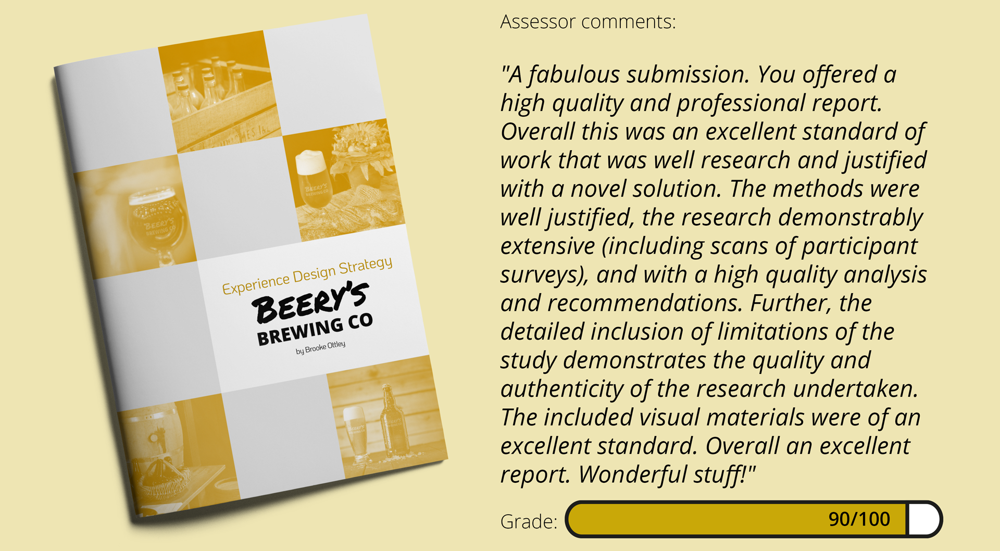
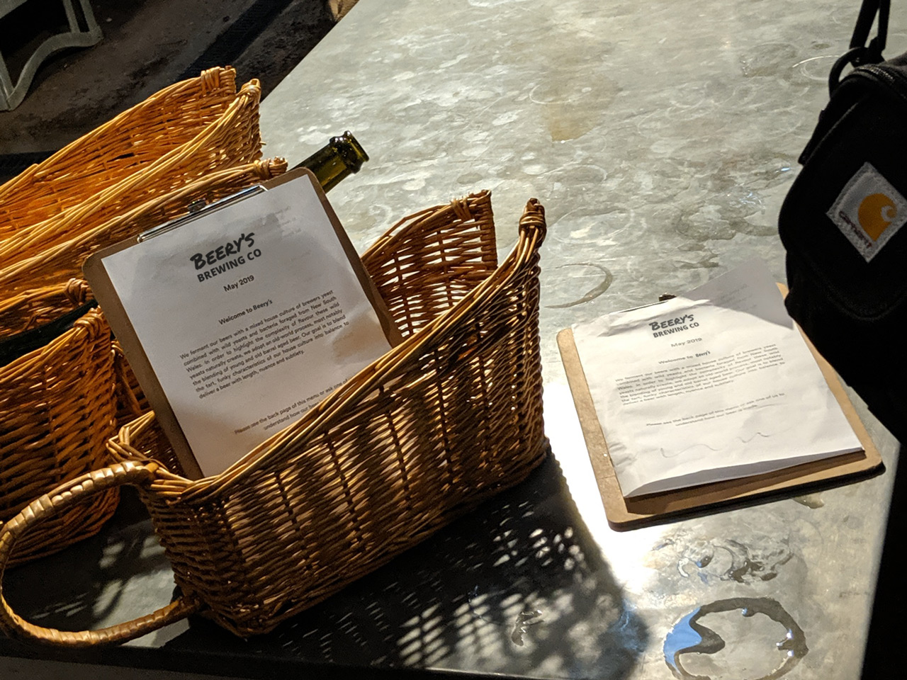
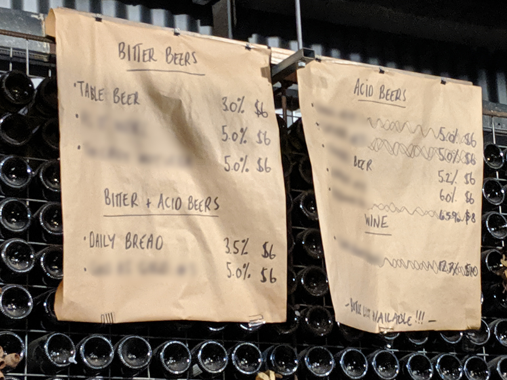
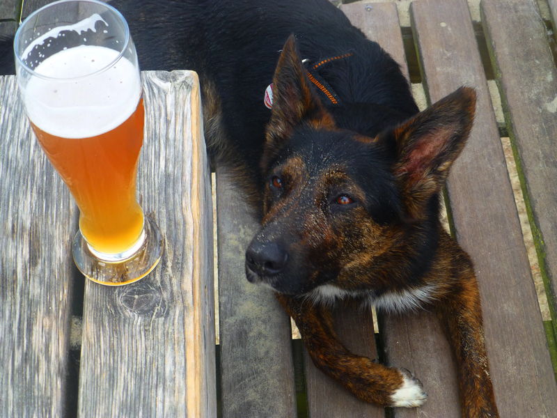
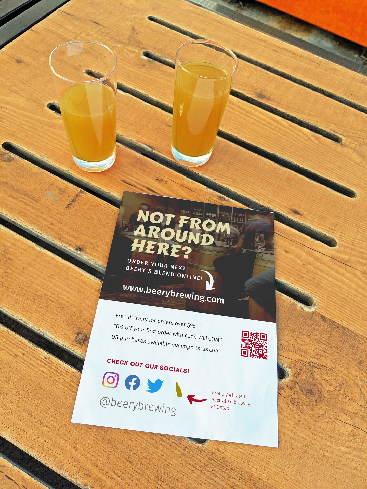
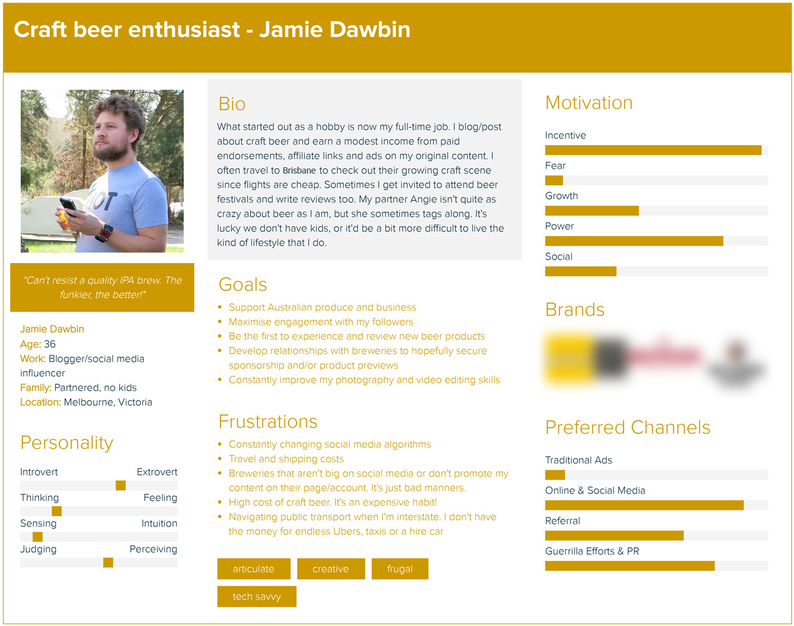
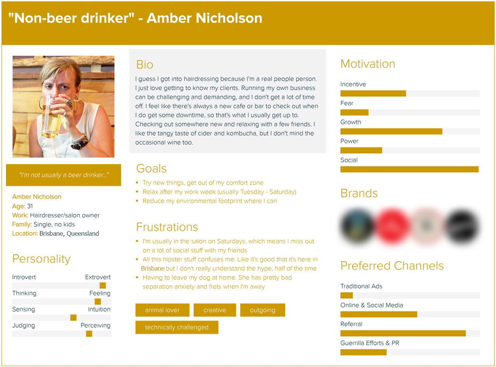
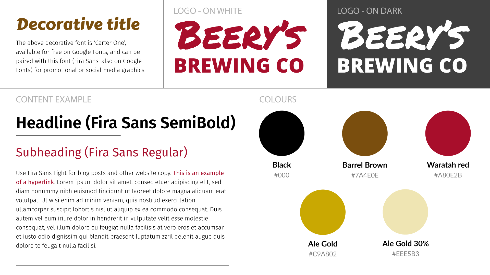
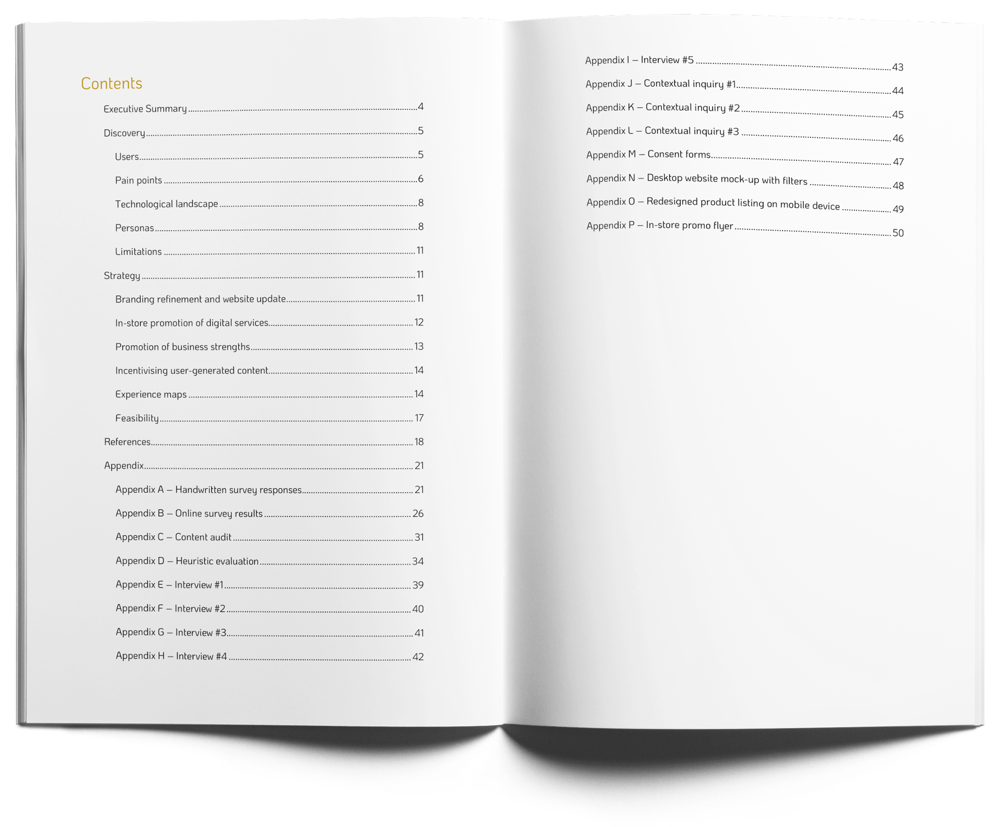

## About
This was a university project in which I researched, designed and developed a detailed user experience strategic plan and set of support materials for a local brewery. I undertook client and user research using user experience (UX) research methods and methodologies, identified pain points in the existing experience, and researched competitors. I developed a strategy including a set of UX materials such as user personas, scenarios and a redesigned user journey and user experience.

## Executive summary

The executive summary from the report is below:
> "Beery’s Brewing Co has developed a range of unique craft beer products, using ‘wild’ yeast. Their technique results in sour and bitter-tasting ales and is known in the industry as ‘mixed fermentation’. Their products are available for purchase direct from the brewery, at brewery events, at dozens of pubs and bars in Queensland and interstate, and through their website. The brewery’s location along a stretch of craft breweries in Brisbane and their Australia-wide online sales distribution means competition is strong. Their customers are generally aware of, and patrons of similar breweries. Thus, it is imperative that Beery’s promote their brand, unique value proposition (UVP) and improve their customer experience in order to remain competitive and boost online and offline sales."

   

> "A variety of user research methods were employed to inform Beery’s strategy in achieving these goals, including a content audit, heuristic evaluation, surveys, interviews and contextual inquiries. The research findings revealed that communication of key messages such as Beery’s UVP, free shipping offer and essential product information was unclear or ineffective. Branding inconsistencies and legibility issues with its website, social media and brewery signage were also identified. Other pain points included their limited opening hours, outdated menus, product cost, bottle size and use of jargon. Beery’s is providing an excellent face-to-face experience, but their social media and website presences are less impressive. Their website provides comprehensive information but is organised in a way that is not visually engaging and does not necessarily make the most sense to their users."

 

> "The proposed strategy comprises a series of simple adjustments to Beery’s face-to-face and online services and an update of its visual branding, which is expected to produce a noticeable overall improvement in its customer experience. Consolidating the number of fonts and colours used in Beery’s promotional material is highly recommended, as it will create a more professional and recognisable identity for their business, as well as complement the ‘premium’ feel of their product offering. A more visually appealing and efficient Shopify theme along with a restructure of the business’s information architecture could complement this branding refinement. It would also address Beery’s goal of encouraging online purchases."

 

> "Promoting Beery’s online store and stimulating user-generated content among its brewery visitors – some of whom are first-time visitors and not part of Beery’s social media audience – could generate ongoing engagement with the brewery, exposure to new customers through earned media and sales outside of their restricted opening hours. Furthermore, enhancing the prominence of Beery’s perceived strengths and existing customer incentives may persuade disinterested potential customers to complete a purchase or become more involved with the brand."

## [Download the full Beery's Brewing Co experience design strategy (13.6MB PDF)](Experience-design-strategy-Beerys-Brewing-Co.pdf)

## Disclaimer
_All references to the business and its competitors in this strategy have been substituted or censored, to protect the identity and reputation of the actual business this research was conducted on._
