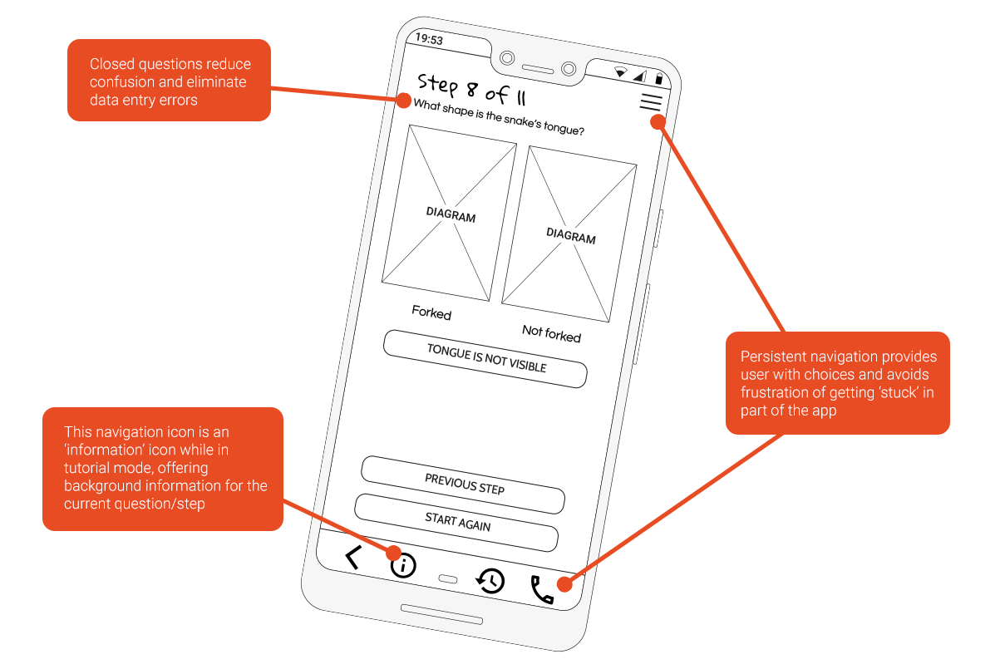
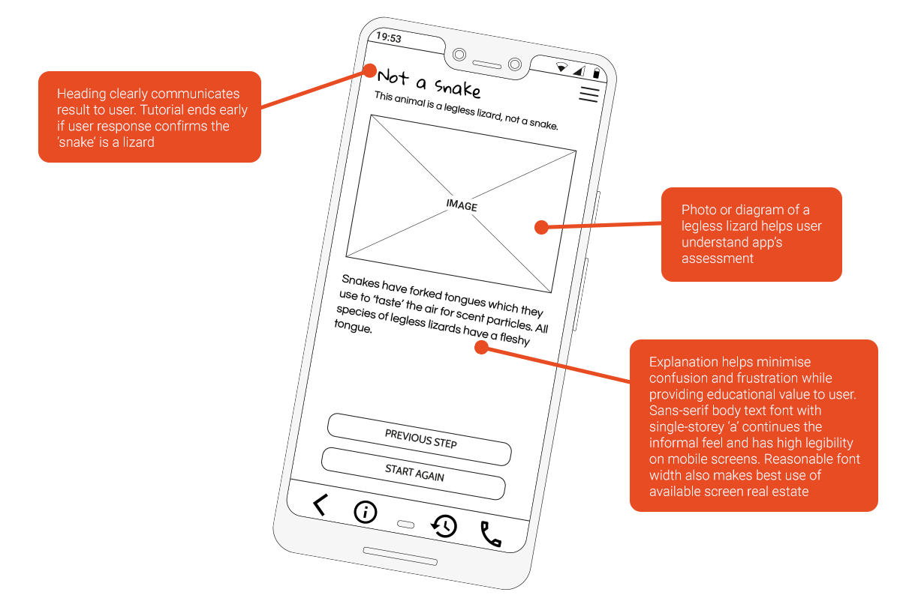

---
Snake Spotter mobile app prototype
---

## About
The Snake Spotter mobile app endeavours to ease users’ fear towards wild snakes by suggesting which type of snake they have encountered. It achieves this through a process of elimination, asking the user simple questions about the snake’s appearance and showing relevant search results from a national database of Australian snake species.

This was a group assessment as part of my Bachelor of Communication (Digital and Social Media) completed in 2019 at the University of Technology Sydney. Our team of three students produced this prototype based on my original concept over a period of 5 weeks.

## [► View the live app demo ◄](demo/frame.html)

## Project timeline

## My role

## Application architecture

## Wireframes

## Colour palette

The primary ‘Rose of Sharon’ and secondary ‘Gamboge’ colours in Snake Spotter’s palette were chosen due to their commonality with the natural environment and the appearance of many Australian snakes. A third colour swatch, ‘Cinnabar’, was used in the Safety Warning screen and to highlight other important information in the app.

## Final UI screens

